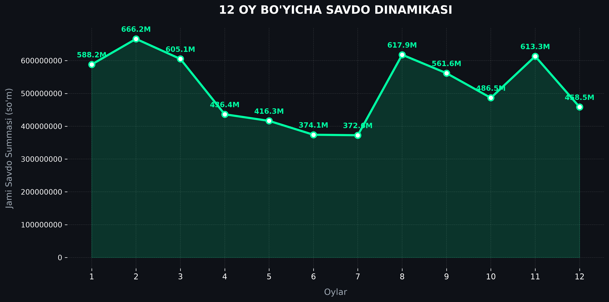
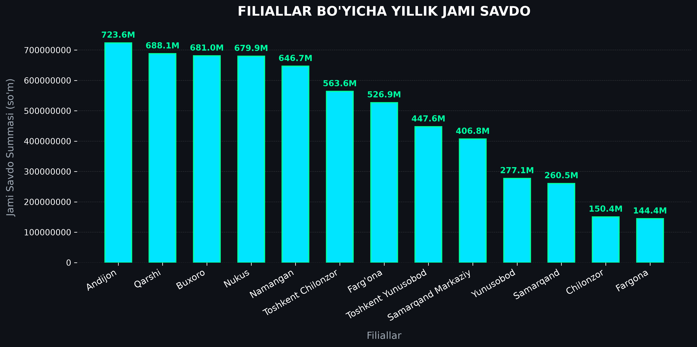
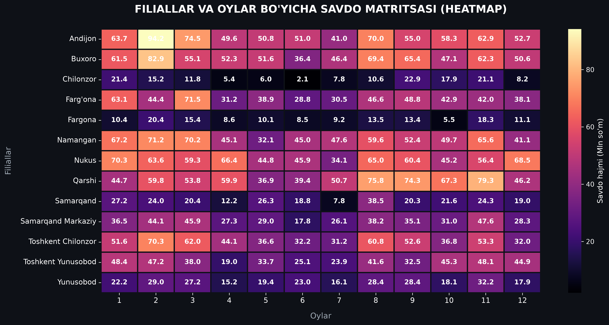
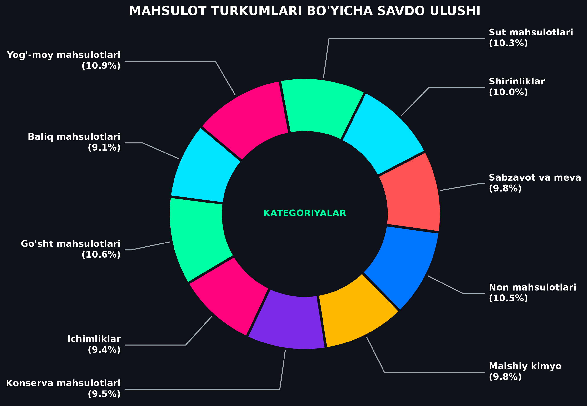

# Sales-data-analysis-python
Interactive EDA, visualizations, and business insights on sales data using Python and Seaborn.

# 📊 Savdo ma'lumotlari tahlili va biznes analytics (Sales EDA)

Ushbu loyihada **Python (Pandas, Seaborn, Matplotlib)** kutubxonalari yordamida yillik savdo ma'lumotlari chuqur tahlil qilindi va biznes uchun muhim bo'lgan asosiy ko'rsatkichlar (KPI) aniqlandi.

---

## 🛠️ Ishlatilgan texnologiyalar
- **Til:** Python
- **Muhit:** JetBrains DataSpell / Jupyter Notebook
- **Kutubxonalar:** Pandas, NumPy, Seaborn, Matplotlib

---

## 📊 Tahlil natijalari va grafik vizualizatsiyasi

### 1. 12 Oylik savdo dinamikasi

*Yillik savdo hajmining mavsumiy tebranishlari va piko oylari.*

---

### 2. Filiallar bo'yicha jami savdo

*Eng ko'p va eng kam daromad keltirgan filiallar reytingi.*

---

### 3. Savdo matrisasi (filial × oy heatmap)

*Filiallar va oylar kesimidagi savdo zichligini ko'rsatuvchi issiqlik xaritasi.*

---

### 4. Mahsulot turkumlari va to'lov turlari ulushi

---

## 💡 Biznes uchun asosiy xulosalar va tavsiyalar
1. **Passiv oylarni faollashtirish:** Savdo sust kechgan oylarda xaridorlarni jalb qilish uchun maxsus promo-kampaniyalar o'tkazish.
2. **Kuchsiz filiallarni qo'llab-quvvatlash:** Savdo hajmi past bo me'yorda bo'lgan filiallarda eng ko'p sotiladigan Top-10 mahsulotlar zaxirasini ko'paytirish.

---
*Loyiha muallifi: Mohinur Qulmurodova
